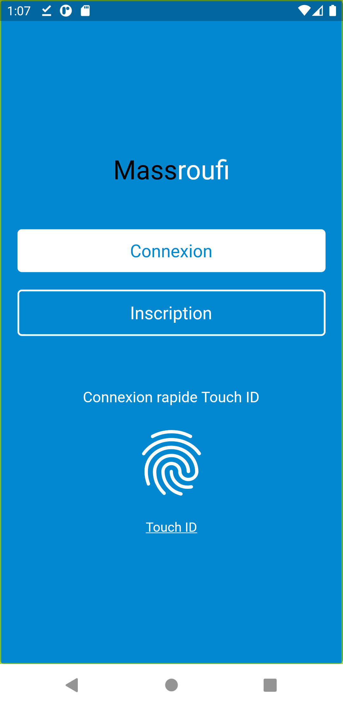
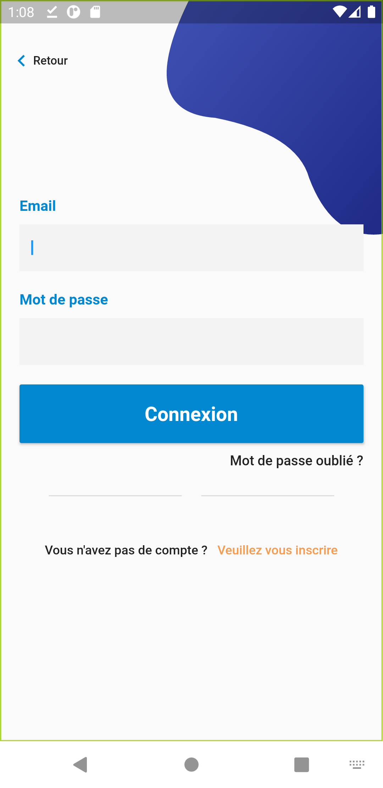
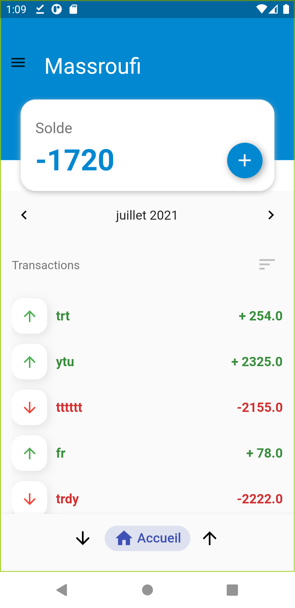
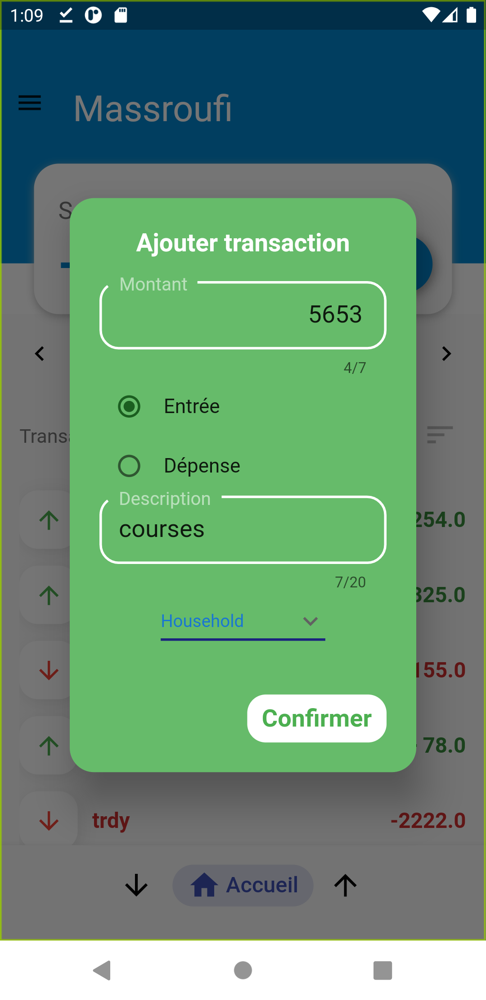
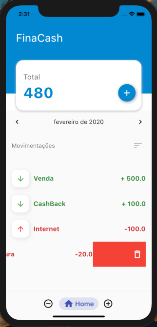
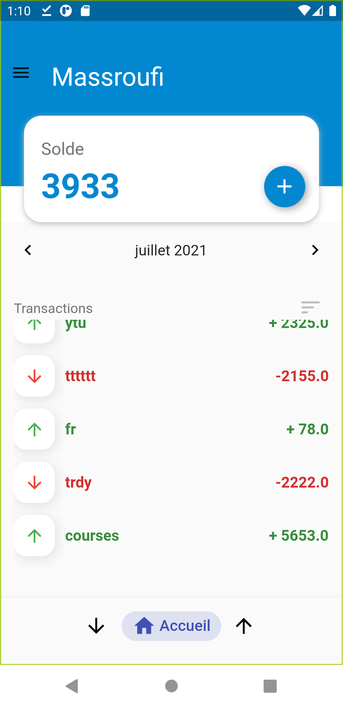

# Flutter + Dart + Sqlite

  

<h1 align="center">Massroufi - مصروفي</h1>
<h3 align="center">"مصروفي تحت تصرفي".</h3>

## Description
L’application MASSROUFI permet de gérer le budget personnel en enregistrant manuellement 
toutes les entrées d’argent et les dépenses par catégorie (revenu, loyer, factures, alimentation,
transports).

## Comment exécuter le projet 
* 1 ère chose : faire un clone de ce projet en utilisant la commande `clone`. 
* 2 ème chose : Ouvrir le projet dans l IDE Android Studio ou VS Code.
* 3 ème chose : Lancer un emulateur, sinon utiliser votre téléphone en mode dévloppeur.
* 4 ème chose : Lancer la commande `flutter pub get` pour installer les dependances.
* 5 ème chose : Lancer la commande `flutter run`.
* 6 ème chose : Enjoy ...

  

  

  

  

  

  

  

